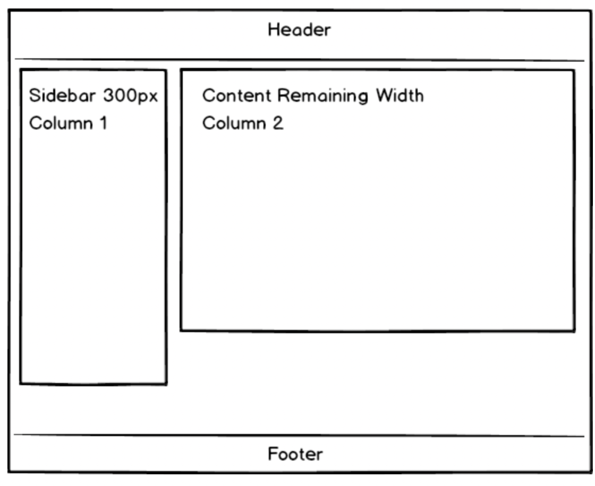
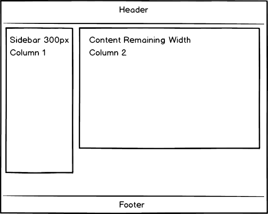

# CSS Flexbox Layout Homework

Using CSS to create a website that looks good to as many users as possible can be a challenge. Your webpage may look great on the screen you designed it on, but if you open the page up on a small laptop, suddenly the page content is squeezed, spilling over, or pushed out of place. If you open that same page on a larger monitor, you might see excess empty space.

However, CSS has some powerful solutions for this. In this homework assignment we will be using flexbox to create different layouts. 

## Objectives 
1. Setting up a **Flex Container** 
2. Identify and use **Flex Properties**

#

## Getting Started 
- Clone ths directory by running the following command inside of your terminal: 
    - `git clone ` 
- On your terminal command line, navigate into the cloned directory: 
    - `cd css-hw-flexbox-layout`

#

## `Flexbox Layout 1`

- open the file `layout1.html`
- Make the layout below using Flexbox. 
- Use different color backgrounds so you can see the width and height of each column. 
- Content for each column should have varying heights.

#

## `Flexbox Layout 2`

- open the file `layout2.html`
- Make the layout below using Flexbox. 
- Use different color backgrounds so you can see the width and height of each column. 
- Content for each column should have varying heights but the columns should be the same height.

## Submission

