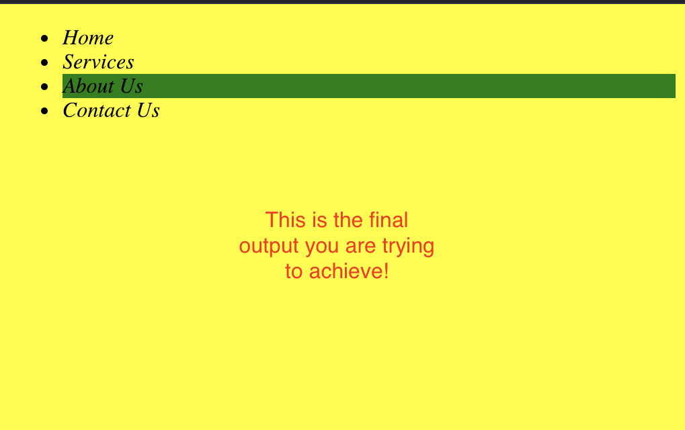

# CSS 101 Applying Styles Lab Exercises

In this lab, you are going to practice the basics of CSS. 

## Objectives 
- Make the browser output look like the example.

## Instructions 

- **Fork** this repo to your account by clicking on the **fork** Button at the top of this page. 


*A **fork** is a copy of this repository. This forked repository will appear on your github account.*

- Find the repository on *YOUR* account (ie yourUserName/repoName) and click on the green `Code` button at the top of the page.


- Copy the path in the dialogue box
- Navigate to a location on **your local computer in VSCode** where you keep your homework 
- Clone this repository by typing the following command in your terminal

```
git clone [`path that you just copied`]
```

For example: 

```bash 
git clone git@github.com/[yourGitUsername]/css-lab-101-applying-style-to-a-list.git
```

- Use Live Server in VSCode to view the `html` in your browser.


## Problems 

#### 1. Fix the problem
- Apply styling with CSS to make the browser output look like this example.


