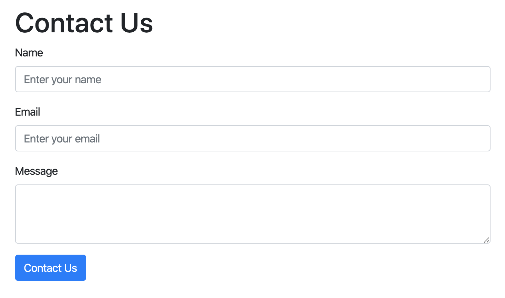
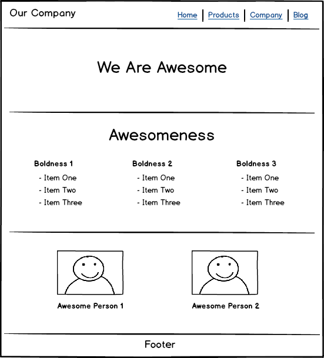
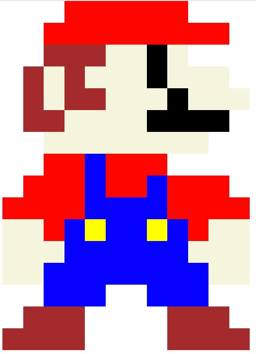

# Bootstrap Lab Exercises 

## Objectives 
1. Initialize Bootstrap
2. Apply different container classes
3. Implement the Bootstrap Grid System
4. Practice different layouts with Bootstrap

#

## Getting Started 
- Clone this directory by running the following command inside of your terminal: 
    - `git clone https://github.com/DigitalCraftsStudents/css-lab-bootstrap-practice.git` 
- On your terminal command line, navigate into the cloned directory: 
    - `cd css-lab-bootstrap-practice` 

#

## Setting up Bootstrap
Setup a file to use the Bootstrap CSS Framework 

- Open the file `index.html` 
- Read through the [bootstrap documentation](https://getbootstrap.com/docs/5.2/getting-started/introduction/#cdn-links)
- Link the Bootstrap stylesheet to this file 
- Link the Bootstrap JS file to this file

## Bootstrap Stylesheet 
Observe the results of attaching a bootstrap stylesheet to an existing html page

- Open the file `2.LinkCSS.html`
- This file has no styling applied to it, but the html elements have many classes applied to the css attribute.  These are bootstrap class names. 
- Instead of creating your own css stylesheet, link to the Bootstrap stylesheet in the head section of the html page.
- What happened when you applied the stylesheet?
- Add the bootstrap javascript file before the closing body tag.

## Containers 

Observe the difference between the `container` class and the `container-fluid` class.

- Open the file `3.Containers.html`
- Apply the bootstrap stylesheet
- Open the file in your browser.  There are two purple div tags that span the entire page 
- Link the Bootstrap css stylesheet to this page 
- Apply the `container` class to the first div and observe the changes 
- Apply the `container-fluid` class to the second div and observe the changes

## Rows 
Nest rows inside of a container and obeserve the changes. 

- Open the file `4.Rows.html` 
- Apply the bootstrap stylesheet
- You should see a purple box which is a container.
- Some color has been added to the container and rows that are on the web page to differentiate between the container and row elements.
- Inside the container, add two 
s and make both elements rows.
- Add some content, like text, inside the 
s to give the 
s some height!

## Grid 
Learn how the Bootstrap grid works in different configurations.  **Go through this lab with your instructor.**

- Open the file `5.Grid.html`
- Apply styles for each exercise. 

## Form 

Recreate the following form component using the [forms components](https://getbootstrap.com/docs/5.2/forms/overview/) inside the `6.Form.html` file.

## Basic Layout 

Use Bootstrap to make the layout pictured below. Write your code in the `7.BasicLayout.html` file.

## Mario Pixel art

Recreate the following pixel art image using the Bootstrap grid system. Write your code in the `8.Mario.html` file. 

