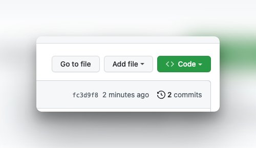

# JavaScript Loops Lab Exercises

In this lab, you are going to practice the basics of writing **for loops and while loops**, using JavaScript as a programming language, by completing problems that will challenge your knowledge of core princples. 

## Objectives 

- constructing a `for` loop
- constructin a `while` loop
- What is the difference between a `for` loop and a `while` loop


## Instructions 

- **Fork** this repo to your account by clicking on the **fork** Button at the top of this page. 


*A **fork** is a copy of this repository. This forked repository will appear on your github account.*

- Find the repository on *YOUR* account (ie yourUserName/js-lab-loops) and click on the green `Code` button at the top of the page.



- Copy the path in the dialoge box
- Navigate to a location on **your local computer in VSCode** where you keep your homework 
- Clone this repsository by typing the following command in your terminal

```
clone [`path that you just copied`]
```

For example: 

```bash 
clone https://github.com/DigitalCraftsStudents/js-lab-loops.git
```

- Navigate into the folder titled `js-lab-loops`
- Open the file called `loops.js` and solve the lab problems 
- To run a file javascript file using node, you can run it from your terminal like this:

```bash
$ node loops.js
```


## Problems

1. Repeat the following phrase 5 times to your terminal by using a `for loop`.

"Repetition is a good thing"

2. Solve the problem above again using a `while loop`.

3. Write a `for loop` that prints the numbers from 1 to 10 to the console.
4. Write a `while loop` that prints the numbers from 1 to 10 to the console.

5. Write a `for loop` that prints the even numbers from 1 to 20 to the console.
6. Write a `while loop` that prints the even numbers from 1 to 20 to the console.

7. Write a `for loop` to print the numbers 0 - 20
8. Write a `while loop` to print the numbers 0 - 20

9. Write a `for loop` that prints the numbers from 10 to 1 to the console.
10. Write a `while loop` that prints the numbers from 10 to 1 to the console.


11. Write a `while loop` that keeps asking a user to enter in a word.  The program loop should stop when the user enters the workd `exit`


12. Print only the ODD values from 3 - 29, one number per line

13. Print the EVEN numbers 12 down to -14 in descending order, one number per line

14. Print the numbers 50 down to 20 in descending order, but only if the numbers are multiples of 3

15. Write a loop that calculates the sum of the numbers from 1 to 100 and prints the result to the console.


